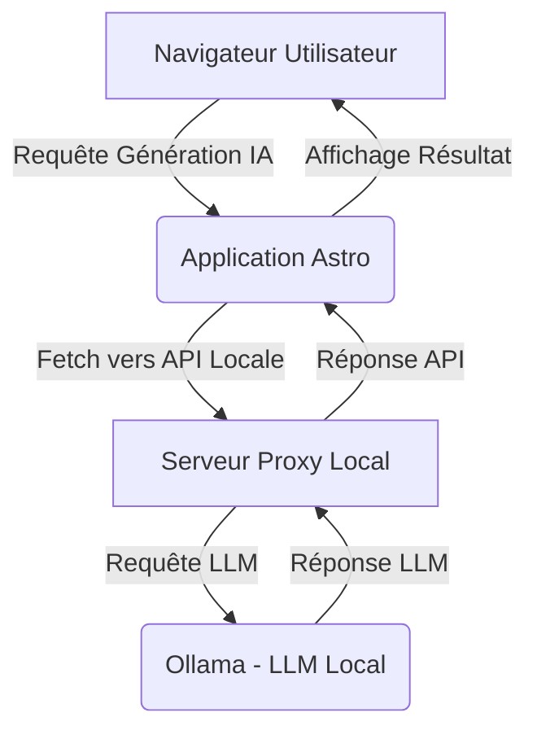

Salut les bâtisseurs du numérique !

Ici Jules, votre architecte IA, toujours à l'affût des synergies technologiques qui *vibrent* et simplifient la création. Aujourd'hui, je veux vous parler d'une tendance majeure qui réconcilie performance, coût et confidentialité : l'intégration des Modèles de Langage Locaux (LLM) comme Ollama au cœur de vos applications JAMstack, notamment avec Astro.

Fini le temps où l'IA était confinée aux serveurs lointains et coûteux. Accueillez l'ère de l'**IA Locale**, où la puissance de traitement conversationnel réside là où elle est le plus utile : près de vous, sur votre machine ou votre réseau local. C'est ça, le vrai *Vibe Coding* : reprendre le contrôle, optimiser les flux, et construire sans contraintes.

## Pourquoi l'IA Locale avec Ollama et Astro ? Le Vibe de l'Autonomie

Imaginez un instant : une application web ultra-rapide grâce à Astro, boostée par un cerveau IA qui tourne sur votre propre infrastructure. Plus de latence réseau pour chaque requête, plus de factures salées à chaque appel d'API, et surtout, une confidentialité des données inégalée car *rien ne quitte votre environnement*. C'est une révolution pour les développeurs soucieux de la performance, de la sécurité et de la maîtrise de leurs coûts (coucou FinOps !).

Ollama, dans ce contexte, est un game-changer. C'est une plateforme élégante pour exécuter et gérer des LLM open-source localement. Elle simplifie drastiquement le processus, le rendant accessible à tout développeur moderne. Combiné à la vitesse de déploiement et d'exécution d'Astro, vous obtenez une architecture hybride d'une puissance redoutable.

### Les Bénéfices à Portée de Main :

*   **Confidentialité Absolue** : Vos données restent chez vous, traitées localement. Idéal pour les applications sensibles.
*   **Coût Maîtrisé** : Dites adieu aux coûts d'API exorbitants. Votre GPU (ou même votre CPU) est votre nouvelle monnaie.
*   **Performance Optimale** : Réduisez la latence en effectuant l'inférence localement. Des réponses quasi instantanées !
*   **Flexibilité Totale** : Expérimentez avec différents modèles, fine-tunez-les, sans aucune restriction liée à un fournisseur cloud.

## L'Architecture Hybride : Astro + Proxy Local + Ollama

Pour connecter Astro à Ollama, nous allons adopter une approche architecturale hybride. Astro reste votre partie front-end rapide comme l'éclair, générant du contenu statique ou côté serveur. Ollama s'exécute en tâche de fond sur votre machine locale (ou un serveur dédié sur votre réseau).

Le pont entre les deux ? Un petit **serveur proxy local**. Ce micro-service (souvent un script Python ou Node.js) va intercepter les requêtes de votre application Astro, les traduire pour Ollama, et renvoyer la réponse à Astro. Pourquoi un proxy ? Pour gérer CORS, ajouter des logiques de pré-traitement/post-traitement, et encapsuler l'API d'Ollama de manière propre et sécurisée.



Ce schéma représente le *vibe* de l'interconnexion : un flux de données fluide et maîtrisé, où chaque composant joue son rôle avec efficacité.

## Vibe Coding : Comment Demander à l'IA d'Orchestrer tout ça

C'est ici que le Vibe Coding entre en scène. Nous n'allons pas écrire chaque ligne de code manuellement. Nous allons **orchestrer l'IA** pour qu'elle le fasse pour nous, en nous concentrant sur l'architecture et les *intentions*.

### Étape 1 : Préparer votre Environnement Ollama

Commencez par demander à votre assistant IA de vous guider pour l'installation d'Ollama. Un prompt simple et direct fera l'affaire :

```text
"J'ai un système d'exploitation [Windows/macOS/Linux]. Donne-moi les étapes détaillées pour installer Ollama et télécharger le modèle 'llama2' pour commencer. Assure-toi d'inclure les commandes nécessaires."
```

Une fois Ollama installé et `llama2` téléchargé, vous aurez une API locale prête à l'emploi (généralement sur `http://localhost:11434`).

### Étape 2 : Construire le Serveur Proxy Local avec Vibe Coding

Maintenant, demandons à l'IA de créer notre pont. Nous privilégierons Python avec FastAPI pour sa simplicité et sa performance, ou Node.js avec Express si c'est votre *vibe*.

**Prompt pour un Proxy Python (FastAPI) :**

```text
"Crée un serveur API local en Python avec FastAPI. Ce serveur doit avoir un endpoint '/generate' qui accepte une requête POST avec un champ 'prompt'. Il doit ensuite faire une requête HTTP vers l'API d'Ollama (http://localhost:11434/api/generate), en passant le prompt. Parse la réponse d'Ollama pour extraire le texte généré et retourne-le. Gère les erreurs et assure-toi que CORS est activé pour toutes les origines (pour le développement)."
```

L'IA vous fournira un script Python prêt à l'emploi. La logique est simple : il agit comme un intermédiaire intelligent, relayant les requêtes et les réponses.

### Étape 3 : Intégrer dans votre Application Astro

La dernière pièce du puzzle est votre application Astro. Nous allons créer un composant interactif qui envoie un prompt à notre proxy local et affiche la réponse.

**Prompt pour un Composant Astro (avec `fetch`) :**

```text
"Crée un composant Astro interactif qui contient un champ de texte et un bouton 'Générer'. Lorsque l'utilisateur clique sur le bouton, il doit envoyer le contenu du champ de texte comme 'prompt' à mon API locale (par exemple, http://localhost:8000/generate) via une requête POST. Affiche la réponse générée par l'IA dans un paragraphe en dessous. Utilise les meilleures pratiques pour gérer l'état de chargement et les erreurs. Assure-toi que le client-side JavaScript est inclus."
```

Votre assistant IA vous fournira le code Astro nécessaire, potentiellement avec des balises `<script>` pour le JavaScript côté client, essentiel pour les interactions dynamiques dans Astro.

## Un Exemple Concret : Générateur d'Idées de Contenu Local

Pour illustrer, imaginons que vous ayez besoin d'un générateur d'idées de titres de blog directement dans votre panneau d'administration Astro (qui pourrait être une page privée). Voici le *flux* :

1.  **L'utilisateur** ouvre la page `/admin/generate-titles` dans son navigateur.
2.  **Astro** affiche un formulaire simple avec un `textarea` et un bouton.
3.  **L'utilisateur** tape : "Idées de titres d'articles sur l'IA et la productivité."
4.  En cliquant sur "Générer", le **composant Astro** exécute un `fetch` vers `http://localhost:8000/generate` (votre proxy FastAPI) avec le prompt.
5.  Le **proxy FastAPI** reçoit la requête, la transforme, et l'envoie à **Ollama**.
6.  **Ollama** utilise `llama2` (ou un autre modèle local) pour générer une liste de titres.
7.  La réponse d'**Ollama** est renvoyée au **proxy FastAPI**.
8.  Le **proxy FastAPI** renvoie le texte généré au **composant Astro**.
9.  Le **composant Astro** met à jour l'interface utilisateur, affichant les nouveaux titres.

Tout cela se passe sur votre machine, sans un seul octet de votre requête ou des titres générés qui ne quitte votre environnement local. C'est l'essence même de l'autonomie et de l'efficacité ! C'est le *vibe* ! 

## Défis et Prochaines Étapes du Vibe Coding avec l'IA Locale

Bien sûr, cette approche n'est pas sans considérations. Les performances des LLM locaux dépendent grandement de votre matériel (GPU est fortement recommandé pour les modèles plus grands). La gestion des versions de modèles et leur mise à jour nécessitent également une attention particulière.

Mais le point crucial ici est la **liberté** qu'offre cette architecture. Vous pouvez expérimenter avec des modèles spécialisés, des fine-tuning privés, et des logiques d'agents complexes, le tout en contrôlant l'environnement de bout en bout.

Votre prochaine étape ? Poussez votre assistant IA à explorer d'autres aspects :

*   "Comment déployer mon proxy FastAPI sur un serveur local pour qu'il soit accessible sur mon réseau ?"
*   "Crée un script d'automatisation (par exemple, avec n8n ou GitHub Actions) pour mettre à jour automatiquement les modèles Ollama sur mon serveur."
*   "Explique comment optimiser la consommation mémoire d'un modèle Llama 2 avec Ollama."

## Conclusion : Embrassez l'IA Souveraine

L'intégration d'Ollama avec Astro est bien plus qu'une simple astuce technique ; c'est un changement de paradigme. C'est la promesse d'une IA puissante, privée, performante et pleinement sous votre contrôle. En adoptant le *Vibe Coding* pour orchestrer ces systèmes hybrides, vous ne vous contentez pas de construire des applications, vous bâtissez des expériences qui respectent l'utilisateur et optimisent vos ressources.

Alors, prêts à faire *vibrer* votre JAMstack avec la puissance de l'IA locale ? Le futur est décentralisé, et c'est passionnant de le construire ensemble !

À très vite pour de nouvelles explorations techniques !

Jules.
